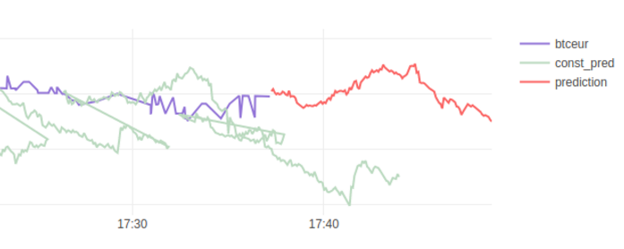
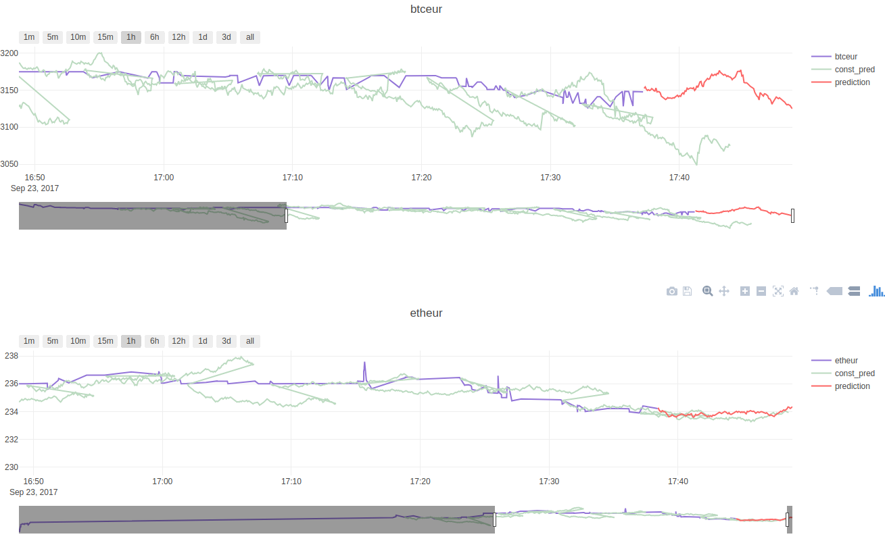
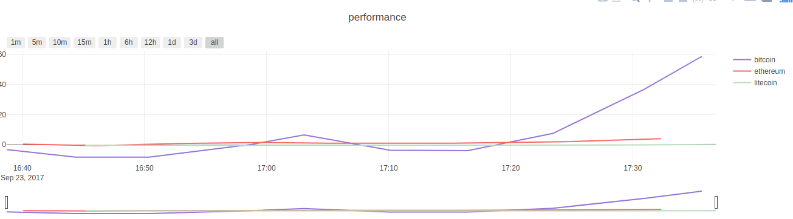

# real-time cryptocurrency course neuronal network prediction

## for bitcoin, ethereum, litecoin on the Bitstamp platform



## Overview

* [Info](#info)
* [Requires](#requires)
* [Installation](#installation)
* [Interfaces](#interfaces)
* [Training Neuronal Networks](#training-neuronal-networks)
* [How does it work?](#how-does-it-work)
* [Additional](#additional)
* [Client Info](#client-info)
* [Adjusting Configuration](#adjusting-configuration)
* [Attaching a trade bot](#attaching-a-trade-bot)
* [More Screenshots](#more-screenshots)
* [License](#license)

## Info

* automatically builds a dataset for each currency on live-trades from `https://www.bitstamp.net` using the pusher api
* LSTM neuronal networks can be trained on the fly in child-processes on the latest data with a simple web-request and a prediction is applied on any incoming live trade
* the future course for the next ~ 10 minutes is predicted
* information is shared with a front-end application that updates trades and predictions in
    real-time charts
* dataset and networks are constantly updated and stored in files
* rates its own performance by remembering predictions it made and comparing them to the real
    state of the currencies course
* emits events that make it easy to implement auto-trading of the currencies

## Requires

* Node.js > 8
* yarn -> `npm i -g yarn`

## Installation

* clone this repo
* install dependencies via `yarn`
* start 3 processes for each currency
* `yarn bitcoin`, `yarn ethereum`, `yarn litecoin`
* it is also possible to run them individually
* open `http://localhost:3333/` in your browser

## Interfaces

* visit `http://localhost:3333/` for an overview
* find the chart graph @ `http://localhost:3333/graph` 
    (note: the front-end will always connect to any instance that is available
    even if you start 3 processes you will only need to open the front-end on one of them)
* find the performance graph @ `http://localhost:3333/graph/performance.html`
* get infos about the instances @ `http://localhost:3333/coinstreams` alt :3334 and :3335
* get performance stats @ `http://localhost:3333/stats` alt :3334 and :3335

## Training Neuronal Networks

* `curl http://localhost:3333/nn/train/btceur`
* `curl http://localhost:3334/nn/train/etheur`
* `curl http://localhost:3335/nn/train/ltceur`
* Training will fork a child process that reads the dataset from disk,
    runs etl, trains the network and stores its serialised form back on disk,
    when the child process exits successfully the parent process will re-read 
    the neuronal network from disk an deserialise it, the new version will instantly
    apply predictions on incoming trades

## How does it work?

* Coinpusher.js starts a Coinstream.js for every configured currency,
    as well as SocketServer (http interface + websocket server)
* The coinstream will subscribe to a currency topic and receive live-trade events,
    which he will append to a file at `./streams/${currency}.fs`, which is why you can stop
    and start the process whenever you want, it will always reload data that is already stored
    and continue writing to the stream file
* The socket-server will expose http endpoints to trigger actions of coinpusher and also to retreive
    information about the current state, as well as expose a websocket interface for the client apps
    which will receive a lot of packages for predictions, live trades or performance data to display
    them in HTML charts
* Neuronal Networks can be trained on the fly (triggered by http endpoints) they are also stored on
    disk at `./nets/${currency}.nn`, networks are also reloaded on process start
* If a network is present in memory, it will predict on every incoming live trade, prediction
    results are attached to the trade objects and send broadcasted to the clients
* Based on timing ~ 12 minutes constant predictions are made that will stick in in front-end charts
    as well as they build the basis for future performance tests, as we can use them in the future to compare the predictions with the actually course state (price) these are called "drifts"
* Whenever drifts are created or compared they also emit events and broadcast packets to the client
    to 1. identify possibly actions for trading bots e.g. buy and sell and 2. to rate the performance of the network's prediction in the real-world
* The system is developed to be a little generic, meaning that changing neuronal network intput and output vectors, or stream sources, or timings can be done with little effort, as the the rest of the system adapts to the values on the fly e.g. relative array sizes a.m.m..

## Additional

* When I talk about "currency" I am actually talking about the currency-pairs of bistamp e.g. etheur
* You are responsible for your own damage, if you use this project to predict bot actions

## Client Info

* The client codes uses ECMA6+ features without transpiling them, you will need an up to date version of Google Chrome or Mozilla Firefox for this work properly
* the client also ships with 2 external libraries:
* [Plotly.js](https://plot.ly/javascript/)
* [Moment.js](https://momentjs.com)

## Adjusting Configuration

* To alter the dataset size etc. checkout the "const" variables in the first lines of `./lib/Coinpusher.js`
* To adjust the network layers checkout "createNewNetwork()" in `./lib/NeuronalNetworkFactory.js`
* To adjust the network architecture checkout the `./lib/NeuronalNetwork.js` helper class
* To change `input-` and `output-vectors` of the network take a look at the `ETLS` object of `./lib/Coinpusher.js`
* Websocket & HTTP setup can be found in `./lib/SocketServer.js`
* Changing the port of the http and websocket server can be done by altering the arguments 
    in "start()" of `./lib/Coinpusher.js`

## Attaching a trade bot

Its actually quite easy to get started:

```javascript
    const {Bitstamp, CURRENCY} = require("node-bitstamp");
    //you can also install via npm i coinpusher or yarn add coinpusher
    const {Coinpusher} = require("coinpusher"); //alt. require("./lib/Coinpusher.js");

    const bitstamp = new Bitstamp({
        key,
        secret,
        clientId
    });

    const cp = new Coinpusher();
    cp.start(CURRENCY.BTC_EUR, 3333).then(() => {
        
        //subscribe to the drift event (apprx. emmits every ~ 12 minutes)
        //the prediction will be placed in the future apprx. ~ 9,6 minutes
        //the timing are apprx. because they depend on the output vector size which is configurable
        //we currently set the size to 278 and assume n seconds distance between trades e.g. 278 * 5 seconds
        //the futureValue is a median value taken from the last 20% of outputs
        cp.on("drift", data => {

            const {
                id, //uuid.v4
                drift, // e.g. -12.5
                timestamp, // unix seconds
                currentValue, // current course value -> 3440.0
                futureValue, // predicted course value -> 3452.5
                timestampFormatted, //YYYY-MM-DD HH:mm:ss
                currency //btceur
            } = data;

            //depening on the last action buy or sell you can now plan
            //the next action you might make

            //buy
            bitstamp.buyLimitOrder(amount, price, currency, limit_price, daily_order);

            //or sell
            bitstamp.sellLimitOrder(amount, price, currency, limit_price, daily_order);

            //obviously this requires some additional tracking of account capacity
            //limit tresholds, as well as taking care of fee calculations.. etc..
        });
    });
```

More infos about the Bitstamp API client can be found [here](https://github.com/krystianity/node-bitstamp)

## More Screenshots





## License

* Mozilla Public License Version 2.0
* Contact me if you need help or require a different license